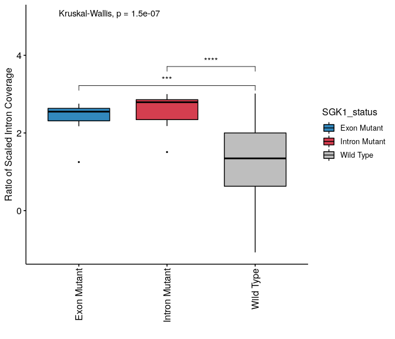

Analysis of Intron Retention in SGK1 in DLBCL
================
Ieuan Walker & Joanna Krupka
5 August 2019

## Objectives

1.  Identify DLBCL cases with SGK1 mutations that affect splicing of
    intron 1,  
2.  Compare the rate of intron retention between wild-type and mutated
    samples.

### Materials and Methods

Single Nucleotide Variants (SNVs) from RNA-Seq samples identified
following [GATK Best Practices
Workflow](https://gatk.broadinstitute.org/hc/en-us/articles/360035531192-RNAseq-short-variant-discovery-SNPs-Indels-).
All scripts used to run this pipeline are available
[here](https://github.com/ashakru/lymphDDX3X).

**Annotations**  
We used [GENCODE v.28 comprehensive gene annotation
set](https://www.gencodegenes.org/human/release_28.html) to build gene
models and predict variants consequences.

**SGK1 reference**  
To investigate SGK1 variants
[ENSG00000118515](https://www.ensembl.org/Homo_sapiens/Gene/Summary?g=ENSG00000118515;r=6:134169246-134318112)
(gene ID) and
[ENST00000237305](https://www.ensembl.org/Homo_sapiens/Transcript/Summary?db=core;g=ENSG00000118515;r=6:134169246-134318112;t=ENST00000237305)
(transcript ID) models were used.

**Hardware**  
Linux Workstation with 56 CPU and 126G memory.

``` r
library(GenomicRanges)
library(GenomicFeatures)
library(rtracklayer)
library(tidyverse)
library(foreach)
library(doParallel)
library(RColorBrewer)
library(rstatix)
library(ggpubr)
library(knitr)

source("utilis.R")

GTF <- "data/gtf/gencode.v28.annotation.gtf"
txdb <- makeTxDbFromGFF(GTF, "gtf", organism = "Homo sapiens")

colors <- c(brewer.pal(11, "Spectral"), "grey")

# Functions
## Function to generate range of SGK1 coordinates by region name
## Coordinates returend in increaseing order  
getCoord <- function(name, model=sgk1){
  start(sgk1[name]):end(sgk1[name])
}
## Function to extact unique sample names from each category
selectSamples <- function(category, data=GOYA_SGK1_Variants_bySample){
  data %>%
  dplyr::filter(SGK1_status %in% category) %>% 
  dplyr::select(SAMPLE) %>%
  distinct() %>%
  as.matrix() %>%
  as.character()
}

# SGK1 regions
exons <- exonsBy(txdb, by = "tx", use.names=TRUE)
sgk1_exons <- exons$ENST00000237305.11
names(sgk1_exons) <- paste0("ex_", sgk1_exons$exon_rank)
introns <- intronsByTranscript(txdb, use.names=TRUE)
sgk1_introns <- introns$ENST00000237305.11
names(sgk1_introns) <- paste0("int_", 11:1)
sgk1 <- c(sgk1_introns, sgk1_exons) # All combined

# Tabular form
sgk1_introns_tab <- as.data.frame(sgk1_introns) %>%
  rownames_to_column("intron")
sgk1_exon_tab <- as.data.frame(sgk1_exons) %>%
  rownames_to_column("exon")
```

#### Read coverage of SGK1

We use `bamCoverage` function from \[Deeptools 2.0\] toolkit to compute
per base coverage of SGK1 region. Values were CPM normalised to account
for the difference in the total number of reads between samples. We use
only uniquely mapped reads (STAR mapping quality = `255`)

``` bash
conda activate utilis
cd data/bam
ls *.bam | cut -d "." -f 1 | parallel -j 5 'bamCoverage -p 10 -bs 1 --region chr6:134169246-134318112 --normalizeUsing CPM --minMappingQuality 255 --bam {}.bam -o ../../GOYA_BamCoverage/{}_SGK1.bw'
```

#### Compute mean coverage of SGK1 introns

Iterate through 553 `BigWig` files. Parallelized with `foreach` and
`doParallel`.

``` r
bigwigs <- list.files("GOYA_BamCoverage", "bw$", full.names = T)

cores=detectCores()
cl <- makeCluster(5) 
registerDoParallel(cl)

intron_CPM <- foreach(i=1:length(bigwigs), .combine=left_join, 
                      .packages = c("rtracklayer", "tidyverse", 
                                    "GenomicAlignments", "magrittr")) %dopar% {
  bw <- rtracklayer::import(bigwigs[i], "BigWig", as = c("GRanges"))
  overlaps <- findOverlaps(sgk1_introns, bw, ignore.strand = T) %>% 
    as.data.frame() %>%
    mutate(intron = sgk1_introns_tab$intron[queryHits],
           score = bw$score[subjectHits],
           region_start = start(bw)[subjectHits],
           region_end = end(bw)[subjectHits],
           region_width = region_end-region_start+1,
           score_corrected = score*region_width) %>%
    left_join(dplyr::select(sgk1_introns_tab, intron, width)) %>%
    group_by(intron) %>%
    summarise(meanCPM = mean(score_corrected)) 
  colnames(overlaps) <- c("intron", splitvec(splitvec(bigwigs[i], "/", 2), "_", 1))
  overlaps
}

sgk1_introns_tab_full <- sgk1_introns_tab %>%
  left_join(intron_CPM)
```

#### Classify SGK1 variants

Classify SGK1 variants into groups based on the confidence of functional
relevance in DLBCL.

*Exon Mutant* = mutation in `chr6:134174586` (exact exon2/intron1 splice
site)  
*Intron Mutant* = mutation in `chr6:134174587` (exact exon2/intron1
splice site)  
*Intron1 Exon2 Variant* = Nonsynonymous variant in intron 1 or exon 2
with allele depth \> 50  
*SGK1 Variant* = Variant with allele depth \> 50, not in Intron1 Exon2  
*Wild Type* = No variants

GnomAD filtering (to remove most common germline variants)

``` r
SGK1_sgnomad <- read_csv("variants/gnomAD_v3.1.1_(non-cancer)_ENSG00000118515_2021_04_13_11_36_07.csv") %>%
  mutate(uniqueID = paste(Position, Reference, Alternate, sep = "_"))

GOYA_SGK1_Variants <- read_csv("variants/GOYA_SGK1variants_combined.csv") %>%
  mutate(uniqueID = paste(start, REF, varAllele, sep = "_"),
         inGnomAD = uniqueID %in% SGK1_sgnomad$uniqueID) 
table(GOYA_SGK1_Variants$inGnomAD)
```

    ## 
    ## FALSE  TRUE 
    ##  3002    71

``` r
# Add SGK1
GOYA_SGK1_Variants_filtered <- GOYA_SGK1_Variants %>% 
  dplyr::filter(FILTER == "PASS" & !inGnomAD) %>%
  dplyr::select(SAMPLE, start, end, CONSEQUENCE, depthALT, depthREF, REF, varAllele, REFCODON, VARCODON) %>%
  distinct() %>%
  mutate(
    SGK1_status = case_when(
      start %in% 134174587 & depthALT >= 10 ~ "Intron Mutant",
      start %in% 134174586 & depthALT >= 10 ~ "Exon Mutant",
      start %in% c(134174618:134174588, 134174585:134174555, 134174732:134174896) & depthALT > 50 &
        CONSEQUENCE != "synonymous" ~ "Other Exon1,Exon2,Intron1 Variant",
      depthALT>50  ~ "Other SGK1 Variant",
      TRUE ~ "Wild Type")) 

GOYA_SGK1_Variants_bySample <- GOYA_SGK1_Variants_filtered %>%  
  group_by(SAMPLE) %>%
  summarise(SGK1_status = unique(SGK1_status)) 

# Define sample groups
intronMut <-selectSamples("Intron Mutant", GOYA_SGK1_Variants_bySample) 
exonMut <- selectSamples("Exon Mutant", GOYA_SGK1_Variants_bySample) 
Ex1int1_mut <- selectSamples("Other Exon1,Exon2,Intron1 Variant", GOYA_SGK1_Variants_bySample) 
Mut_alt <- selectSamples(c("Other SGK1 Variant"), GOYA_SGK1_Variants_bySample) 
```

#### Intergate SGK1 mutation status with the rate of intron retention

``` r
sgk1_introns_annotated <- sgk1_introns_tab_full %>%
  dplyr::select(intron, starts_with("SRR")) %>%
  gather(SAMPLE, meanCPM, -intron) %>%
  mutate(SGK1_status = case_when(SAMPLE %in% intronMut ~ "Intron Mutant",
                                 SAMPLE %in% exonMut ~ "Exon Mutant",
                                 SAMPLE %in% Ex1int1_mut ~ "Other Exon1,Exon2,Intron1 Variant",
                                 SAMPLE %in% Mut_alt ~ "Other SGK1 Variant",
                                 TRUE ~ "Wild Type")) %>%
  ungroup() %>%
  mutate(meanCPM = replace_na(meanCPM, 0)) %>%
  dplyr::group_by(SAMPLE) %>%
  mutate(scaledCPM = scale(meanCPM)) %>%
  dplyr::select(-meanCPM)
```

First, we will visualize the intron retention rate in all categories.

``` r
sgk1_introns_annotated_all <- sgk1_introns_annotated %>%
  dplyr::filter(intron == "int_1") %>%
  distinct() %>%
  ungroup() 
         
table(sgk1_introns_annotated_all$SGK1_status)
```

    ## 
    ##                       Exon Mutant                     Intron Mutant 
    ##                                 7                                10 
    ## Other Exon1,Exon2,Intron1 Variant                Other SGK1 Variant 
    ##                                 7                               107 
    ##                         Wild Type 
    ##                               422

``` r
length(unique(sgk1_introns_annotated_all$SAMPLE))  
```

    ## [1] 553

``` r
sgk1_introns_clear <- sgk1_introns_annotated_all %>%
  #dplyr::filter(SGK1_status != "Discard") %>%
  dplyr::mutate(SGK1_status = factor(SGK1_status, levels = c("Exon Mutant",
                                                             "Intron Mutant", 
                                                             "Other Exon1,Exon2,Intron1 Variant",
                                                             "Other SGK1 Variant",
                                                             "Wild Type")))
```

**Statistical analysis of intron 1 retention**

``` r
table(sgk1_introns_clear$SGK1_status)
```

    ## 
    ##                       Exon Mutant                     Intron Mutant 
    ##                                 7                                10 
    ## Other Exon1,Exon2,Intron1 Variant                Other SGK1 Variant 
    ##                                 7                               107 
    ##                         Wild Type 
    ##                               422

``` r
sgk1_introns_kruskal <- sgk1_introns_clear %>%
 kruskal_test(scaledCPM ~ SGK1_status)
kable(sgk1_introns_kruskal)
```

| .y.       |   n | statistic | df | p | method         |
| :-------- | --: | --------: | -: | -: | :------------- |
| scaledCPM | 553 |  52.41316 |  4 | 0 | Kruskal-Wallis |

``` r
sgk1_introns_wilcox <- sgk1_introns_clear %>% 
  wilcox_test(scaledCPM ~ SGK1_status)
kable(sgk1_introns_wilcox)
```

| .y.       | group1                            | group2                            |  n1 |  n2 | statistic |        p |    p.adj | p.adj.signif |
| :-------- | :-------------------------------- | :-------------------------------- | --: | --: | --------: | -------: | -------: | :----------- |
| scaledCPM | Exon Mutant                       | Intron Mutant                     |   7 |  10 |        18 | 1.09e-01 | 3.27e-01 | ns           |
| scaledCPM | Exon Mutant                       | Other Exon1,Exon2,Intron1 Variant |   7 |   7 |        32 | 3.83e-01 | 3.83e-01 | ns           |
| scaledCPM | Exon Mutant                       | Other SGK1 Variant                |   7 | 107 |       595 | 9.00e-03 | 4.70e-02 | \*           |
| scaledCPM | Exon Mutant                       | Wild Type                         |   7 | 422 |      2579 | 7.10e-04 | 5.00e-03 | \*\*         |
| scaledCPM | Intron Mutant                     | Other Exon1,Exon2,Intron1 Variant |  10 |   7 |        51 | 1.33e-01 | 3.27e-01 | ns           |
| scaledCPM | Intron Mutant                     | Other SGK1 Variant                |  10 | 107 |       922 | 1.65e-04 | 1.00e-03 | \*\*         |
| scaledCPM | Intron Mutant                     | Wild Type                         |  10 | 422 |      3875 | 6.10e-06 | 6.13e-05 | \*\*\*\*     |
| scaledCPM | Other Exon1,Exon2,Intron1 Variant | Other SGK1 Variant                |   7 | 107 |       575 | 1.80e-02 | 7.30e-02 | ns           |
| scaledCPM | Other Exon1,Exon2,Intron1 Variant | Wild Type                         |   7 | 422 |      2545 | 1.00e-03 | 6.00e-03 | \*\*         |
| scaledCPM | Other SGK1 Variant                | Wild Type                         | 107 | 422 |     27895 | 1.66e-04 | 1.00e-03 | \*\*         |

``` r
ggboxplot(sgk1_introns_clear, x = "SGK1_status", y = "scaledCPM",
         fill = "SGK1_status",
         palette = colors[c(1,2,10,11,12)],
         outlier.size = 0.5) +
  # Add pairwise comparisons p-value
  stat_compare_means(comparisons = list(c("Wild Type", "Exon Mutant"),
                                        c("Wild Type", "Intron Mutant"),
                                        c("Wild Type", "Other Exon1,Exon2,Intron1 Variant"),
                                        c("Wild Type", "Other SGK1 Variant")),
                     label = "p.signif") + 
  # Add global p-value
  stat_compare_means(label.y = 5) +
  theme(legend.position = "right",
        axis.text.x = element_text(angle = 90, vjust = 0.5, hjust=1)) +
  labs(y = "Ratio of Scaled Intron 1 Coverage", x = "") 
```

<!-- -->

``` r
ggsave("plots/SGK1_allCategories.pdf")
```

`Intron1 Exon2 Variant` and `SGK1 Variant` are likely to contain large
number of germline variants (lack of germline control in the dataset).
For clarity, we will visualize the intron retention rate with the two
groups exluded.

``` r
# Combine variant
sgk1_introns_annotated_highconf <- sgk1_introns_annotated  %>%
  dplyr::filter(intron == "int_1" & !(SGK1_status %in% c("Other Exon1,Exon2,Intron1 Variant", 
                                                         "Other SGK1 Variant"))) %>%
  distinct() %>%
  ungroup() 
         
table(sgk1_introns_annotated_highconf$SGK1_status)
```

    ## 
    ##   Exon Mutant Intron Mutant     Wild Type 
    ##             7            10           422

``` r
length(unique(sgk1_introns_annotated_highconf$SAMPLE))  
```

    ## [1] 439

``` r
sgk1_introns_clear <- sgk1_introns_annotated_highconf %>%
  dplyr::mutate(SGK1_status = factor(SGK1_status, levels = c("Exon Mutant",
                                                             "Intron Mutant",
                                                             "Wild Type")))
```

**Statistical analysis of intron 1 retention**

``` r
table(sgk1_introns_clear$SGK1_status)
```

    ## 
    ##   Exon Mutant Intron Mutant     Wild Type 
    ##             7            10           422

``` r
sgk1_introns_kruskal <- sgk1_introns_clear %>%
 kruskal_test(scaledCPM ~ SGK1_status)
kable(sgk1_introns_kruskal)
```

| .y.       |   n | statistic | df |     p | method         |
| :-------- | --: | --------: | -: | ----: | :------------- |
| scaledCPM | 439 |  31.38571 |  2 | 2e-07 | Kruskal-Wallis |

``` r
sgk1_introns_wilcox <- sgk1_introns_clear %>% 
  wilcox_test(scaledCPM ~ SGK1_status)
kable(sgk1_introns_wilcox)
```

| .y.       | group1        | group2        | n1 |  n2 | statistic |        p |    p.adj | p.adj.signif |
| :-------- | :------------ | :------------ | -: | --: | --------: | -------: | -------: | :----------- |
| scaledCPM | Exon Mutant   | Intron Mutant |  7 |  10 |        18 | 1.09e-01 | 1.09e-01 | ns           |
| scaledCPM | Exon Mutant   | Wild Type     |  7 | 422 |      2579 | 7.10e-04 | 1.00e-03 | \*\*         |
| scaledCPM | Intron Mutant | Wild Type     | 10 | 422 |      3875 | 6.10e-06 | 1.84e-05 | \*\*\*\*     |

``` r
ggboxplot(sgk1_introns_clear, x = "SGK1_status", y = "scaledCPM",
         fill = "SGK1_status",
         palette = colors[c(10,2,12)],
         outlier.size = 0.5) +
  # Add pairwise comparisons p-value
  stat_compare_means(comparisons = list(c("Wild Type", "Exon Mutant"),
                                        c("Wild Type", "Intron Mutant")),
                     label = "p.signif") + 
  # Add global p-value
  stat_compare_means(label.y = 5) +
  theme(legend.position = "right",
        axis.text.x = element_text(angle = 90, vjust = 0.5, hjust=1)) +
  labs(y = "Ratio of Scaled Intron Coverage", x = "") 
```

<!-- -->

``` r
ggsave("plots/SGK1_spliceSite.pdf")

# Generate supplementary tables
write_csv(sgk1_introns_annotated_highconf, "tables/SGK1_intron1_retentionRate_fig1E.csv")

GOYA_SGK1_intron1exon2 <- GOYA_SGK1_Variants_filtered %>% 
  dplyr::filter(SGK1_status %in% c("Intron Mutant", "Exon Mutant"))
write_csv(GOYA_SGK1_intron1exon2, "tables/SGK1_GOYAvariants.csv")
```

``` r
sessionInfo()
```

    ## R version 4.0.3 (2020-10-10)
    ## Platform: x86_64-conda-linux-gnu (64-bit)
    ## Running under: Fedora 30 (Workstation Edition)
    ## 
    ## Matrix products: default
    ## BLAS/LAPACK: /home/JAK75/anaconda3/envs/rbase4/lib/libopenblasp-r0.3.12.so
    ## 
    ## locale:
    ##  [1] LC_CTYPE=en_GB.UTF-8       LC_NUMERIC=C              
    ##  [3] LC_TIME=en_GB.UTF-8        LC_COLLATE=en_GB.UTF-8    
    ##  [5] LC_MONETARY=en_GB.UTF-8    LC_MESSAGES=en_GB.UTF-8   
    ##  [7] LC_PAPER=en_GB.UTF-8       LC_NAME=C                 
    ##  [9] LC_ADDRESS=C               LC_TELEPHONE=C            
    ## [11] LC_MEASUREMENT=en_GB.UTF-8 LC_IDENTIFICATION=C       
    ## 
    ## attached base packages:
    ## [1] parallel  stats4    stats     graphics  grDevices utils     datasets 
    ## [8] methods   base     
    ## 
    ## other attached packages:
    ##  [1] knitr_1.30             ggpubr_0.4.0           rstatix_0.6.0         
    ##  [4] RColorBrewer_1.1-2     doParallel_1.0.16      iterators_1.0.13      
    ##  [7] foreach_1.5.1          forcats_0.5.0          stringr_1.4.0         
    ## [10] dplyr_1.0.2            purrr_0.3.4            readr_1.4.0           
    ## [13] tidyr_1.1.2            tibble_3.0.4           ggplot2_3.3.3         
    ## [16] tidyverse_1.3.0        rtracklayer_1.50.0     GenomicFeatures_1.42.1
    ## [19] AnnotationDbi_1.52.0   Biobase_2.50.0         GenomicRanges_1.42.0  
    ## [22] GenomeInfoDb_1.26.2    IRanges_2.24.1         S4Vectors_0.28.1      
    ## [25] BiocGenerics_0.36.0   
    ## 
    ## loaded via a namespace (and not attached):
    ##  [1] colorspace_2.0-0            ggsignif_0.6.0             
    ##  [3] ellipsis_0.3.1              rio_0.5.16                 
    ##  [5] XVector_0.30.0              fs_1.5.0                   
    ##  [7] rstudioapi_0.13             farver_2.0.3               
    ##  [9] bit64_4.0.5                 fansi_0.4.1                
    ## [11] lubridate_1.7.9.2           xml2_1.3.2                 
    ## [13] codetools_0.2-18            jsonlite_1.7.2             
    ## [15] Rsamtools_2.6.0             broom_0.7.3                
    ## [17] dbplyr_2.0.0                compiler_4.0.3             
    ## [19] httr_1.4.2                  backports_1.2.1            
    ## [21] assertthat_0.2.1            Matrix_1.3-2               
    ## [23] cli_2.2.0                   htmltools_0.5.1.1          
    ## [25] prettyunits_1.1.1           tools_4.0.3                
    ## [27] gtable_0.3.0                glue_1.4.2                 
    ## [29] GenomeInfoDbData_1.2.4      rappdirs_0.3.1             
    ## [31] Rcpp_1.0.5                  carData_3.0-4              
    ## [33] cellranger_1.1.0            vctrs_0.3.6                
    ## [35] Biostrings_2.58.0           xfun_0.20                  
    ## [37] openxlsx_4.2.3              rvest_0.3.6                
    ## [39] lifecycle_0.2.0             XML_3.99-0.5               
    ## [41] zlibbioc_1.36.0             scales_1.1.1               
    ## [43] hms_0.5.3                   MatrixGenerics_1.2.0       
    ## [45] SummarizedExperiment_1.20.0 yaml_2.2.1                 
    ## [47] curl_4.3                    memoise_1.1.0              
    ## [49] biomaRt_2.46.3              stringi_1.5.3              
    ## [51] RSQLite_2.2.2               highr_0.8                  
    ## [53] zip_2.1.1                   BiocParallel_1.24.1        
    ## [55] rlang_0.4.10                pkgconfig_2.0.3            
    ## [57] matrixStats_0.57.0          bitops_1.0-6               
    ## [59] evaluate_0.14               lattice_0.20-41            
    ## [61] GenomicAlignments_1.26.0    labeling_0.4.2             
    ## [63] bit_4.0.4                   tidyselect_1.1.0           
    ## [65] magrittr_2.0.1              R6_2.5.0                   
    ## [67] generics_0.1.0              DelayedArray_0.16.0        
    ## [69] DBI_1.1.0                   pillar_1.4.7               
    ## [71] haven_2.3.1                 foreign_0.8-81             
    ## [73] withr_2.3.0                 abind_1.4-5                
    ## [75] RCurl_1.98-1.2              modelr_0.1.8               
    ## [77] crayon_1.3.4                car_3.0-10                 
    ## [79] BiocFileCache_1.14.0        rmarkdown_2.6              
    ## [81] progress_1.2.2              grid_4.0.3                 
    ## [83] readxl_1.3.1                data.table_1.13.6          
    ## [85] blob_1.2.1                  reprex_0.3.0               
    ## [87] digest_0.6.27               openssl_1.4.3              
    ## [89] munsell_0.5.0               askpass_1.1
