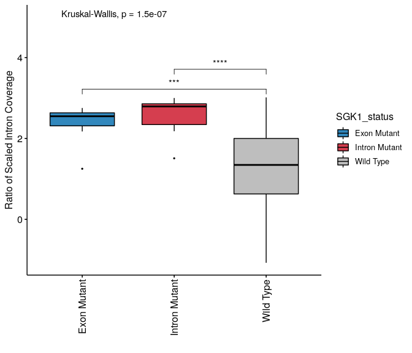
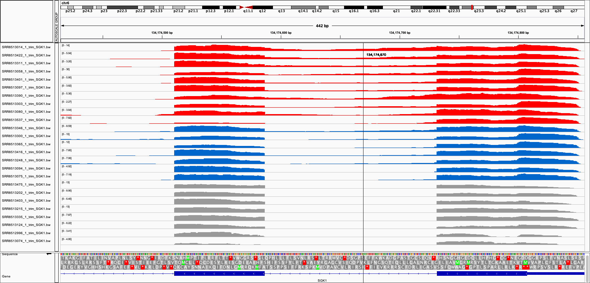

# Aberrant splicing of SGK1 in DLBCL

Analysis of RNA-Seq data from the GOYA trial to identify DLBCL splice-mutant cases and 
look for the presence of aberrantly spliced SGK1 neoisoforms.  

**Publication:**  
[SGK1 mutations in DLBCL generate hyperstable protein neoisoforms that promote AKT independence]() 
Jie Gao, Eirini Sidiropoulou, Ieuan Walker, Joanna Krupka, Karol Mizielinski, 
Shamith Samarajiwa & Daniel J Hodson
 

### Background     

Serum and Glucocorticoid-regulated Kinase-1 (SGK1) is one of the most frequently 
mutated genes in Diffuse Large B Cell Lymphoma (DLBCL). However, little is known 
about its function or the consequence of its mutation. The frequent finding of 
truncating mutations has led to the widespread assumption that these represent 
loss-of-function variants and accordingly, that SGK1 must act as a tumour suppressor. 
Here we show that instead, the most common SGK1 mutations lead to production of 
**aberrantly spliced mRNA neoisoforms** in which translation is initiated from 
downstream methionines. 

Here, we are reanalysing RNA-Seq dataset of 553 DLBCL patients in order to 
find cases with SGK1 mutations and investigate the scale of aberrant splicing in 
these samples. Raw `FASTQ` files are avaliable from GEO with accession number 
[GSE125966](https://www.ncbi.nlm.nih.gov/geo/query/acc.cgi?acc=GSE125966) 
(date accessed 28 October 2019).     

---

### Hypothesis  

The most frequent SGK1 variants found in DLBCL, localised at the end of intron-1 
and the start of exon-2, will disrupt mRNA splicing. Aberrant splicing can be 
identified from RNA-Seq data.  

### Content  

`01_SGK1_IntronRetention.Rmd`  - Core Analysis of SGK1 splicing in DLBCL    
`GOYA_BamCoverage/` - Coverage of SGK1 region in individual samples (BigWig files)   
`variants` - SGK1 variants identified in DLBCL and SGK1 GnomAD used to population variants   

**Results:**
`tables/` -  Supplementary tables  
`plots` -  Plots   

---  

### Conclusions   

1. Mutation in the first base of exon 2 (chr6:134174586) and the last base of intron 1 (chr6:134174587) were found in 7 and 10 samples, respectively.   
2. Mutation of the intron 1 acceptor site (3' end of the intron) and the first base of the exon 2 are associated with statistically significant increase in read coverage of intron 1 (aberrant splicing leading to intron retention).   

**Comparison of the intron retention rate between SGK1 mutant and wild-type samples**

Pairwise comparisons with Wilcoxon rank sum test, adjusted p-values \*\*\* - < 0.001 \*\*\*\* - < 0.0001

**Intron 1 / Exon 1-2 coverage in DLBCL samples**  

Red - Intron Mutation, Blue - Exon mutation, Grey - Representative Wild-type samples

